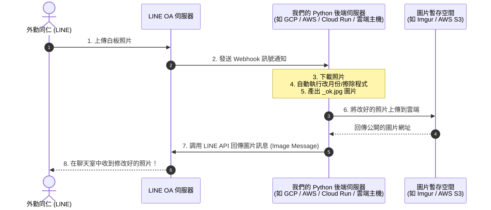

# 💬 萬福環保數位轉型：LINE Bot 串接規劃與專案目錄整理說明

本文件為您備份「萬福環保數位轉型」對話中討論的重要系統架構、程式範本與專案整理歷程，方便您未來隨時開啟查閱。

---

## 📂 1. 專案目錄整理結果

為了保持開發環境整潔，我們將所有檔案做了中文命名與歸類：

* **`01_測試與範例照片庫/`**：存放所有測試用照片、白板照片與 PSD 範本。
* **`02_歷史程式與除錯圖片/`**：收納舊程式、除錯圖片與本對話備份檔（即本檔案 `萬福環保數位轉型.md`）。
* **`03_第一版GitHub網頁資料/`**：存放第一版發布至 GitHub Pages 的 PWA 網頁套件檔案（已解決 `index.html` 的文字亂碼問題）。
* **`skills-lock.json`**：**（請勿移動）** 助理的核心技能鎖定檔，必須保留在最外層根目錄。

---

## 🤖 2. LINE OA 串接與圖片處理自動化規劃

### 🔄 運作流程圖



### 🛠️ 實作這套系統需要準備的 3 件事

1. **申請 LINE 官方帳號**：
   * 在 [LINE Developers](https://developers.line.biz/) 平台建立 Provider，開啟 **Messaging API** 功能，獲取 `Channel Access Token` 與 `Channel Secret`。
2. **一台雲端伺服器 (Backend Server)**：
   * 用於執行 OpenCV 影像處理代碼（例如部署在 GCP、AWS、Render，或臨時使用 `ngrok` 穿透）。
3. **一個輕量網頁服務 (API)**：
   * 在 Python 中寫一個 Flask 或 FastAPI 伺服器接收 LINE 的 Webhook 通訊。

### 📝 Python Flask 串接程式碼範本 (極簡版)

```python
import os
from flask import Flask, request, abort
from linebot import LineBotApi, WebhookHandler
from linebot.exceptions import InvalidSignatureError
from linebot.models import MessageEvent, ImageMessage, ImageSendMessage

app = Flask(__name__)

# 填入您的 LINE 密鑰
line_bot_api = LineBotApi('您的_CHANNEL_ACCESS_TOKEN')
handler = WebhookHandler('您的_CHANNEL_SECRET')

@app.route("/callback", methods=['POST'])
def callback():
    signature = request.headers['X-Line-Signature']
    body = request.get_data(as_text=True)
    try:
        handler.handle(body, signature)
    except InvalidSignatureError:
        abort(400)
    return 'OK'

# 當使用者傳送圖片時觸發此函式
@handler.add(MessageEvent, message=ImageMessage)
def handle_image(event):
    message_id = event.message.id
    
    # 1. 下載 LINE 聊天室裡的原始圖片
    message_content = line_bot_api.get_message_content(message_id)
    temp_input = f"temp_{message_id}.jpg"
    with open(temp_input, 'wb') as fd:
        for chunk in message_content.iter_content():
            fd.write(chunk)
            
    # 2. 自動呼叫您的 Python 擦除/改月份程式
    temp_output = f"ok_{message_id}.jpg"
    # 這裡放我們寫好的影像處理邏輯，例如：
    # run_image_processing(temp_input, temp_output)
    
    # 3. 將成果上傳至暫存空間 (如 Imgur/S3)，取得網址: https://example.com/ok.jpg
    public_url = upload_to_cloud(temp_output) 
    
    # 4. 回傳圖片給使用者
    line_bot_api.reply_message(
        event.reply_token,
        ImageSendMessage(original_content_url=public_url, preview_image_url=public_url)
    )

if __name__ == "__main__":
    app.run(port=5000)
```

---

## 📂 3. 系統內建技能（英文 ➡️ 中文）對照表

我們將原本位於 `.agents/skills/` 內看不懂的英文資料夾，全部重新命名並加上 `2606_` 前綴，以利您閱讀：

* `course-content-authoring` ➡️ **`2606_課程教材編寫`** (撰寫講義、筆記)
* `course-corporate-edition` ➡️ **`2606_企業客製化版本`** (將講義濃縮成企業一日班)
* `course-ebook-publishing` ➡️ **`2606_電子書與手冊出版`** (匯出 PDF/DOCX)
* `course-outline-design` ➡️ **`2606_課程大綱設計`** (規劃章節結構與時間)
* `green-wilderness-notice` ➡️ **`2606_綠野門市公告範本`** (自動生成內部培訓通知)
* `static-spa-conversion` ➡️ **`2606_講義網頁化工具`** (講義轉單頁式網頁)
* `static-spa-interactions` ➡️ **`2606_網頁互動美化加強`** (加入暗色模式與側邊欄等)
* `teaching-site` ➡️ **`2606_教學網站核心主程式`** (網站框架主控)
* `teaching-site-design-system` ➡️ **`2606_教學網站視覺設計`** (設定色彩風格與卡片排版)
* `web-content-audit` ➡️ **`2606_網站檔案一致性檢查`** (檢查圖片缺失與格式對照)
* `web-visual-assets` ➡️ **`2606_網頁配圖與AI生圖`** (繪製插圖與生成 QR 碼)
* `web-visual-verification` ➡️ **`2606_網頁畫面自動測試`** (自動測試模擬網頁是否有錯誤)
